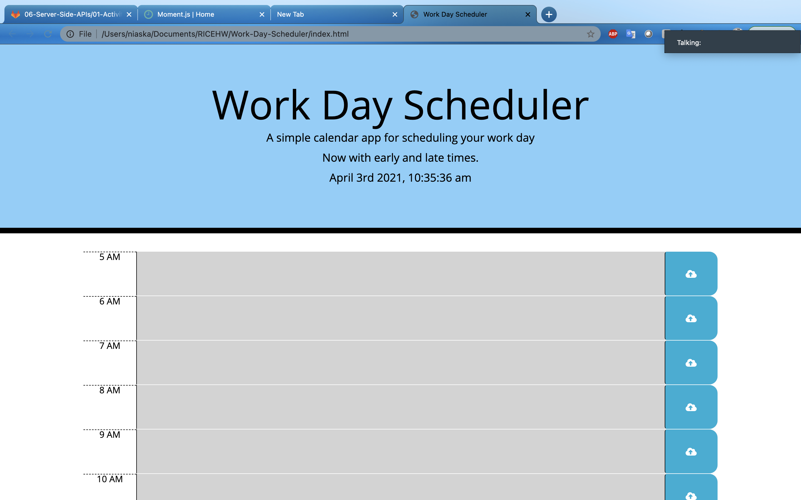

# Work-Day-Scheduler
This website was made from using third-party API. It will log any data you put in the text and you can save it.
Also tracks the current time to mark each row with a different color. Pink for present, green for future, and gray for past event.

Link to website: https://niaskaa.github.io/Work-Day-Scheduler/
Link to github: https://github.com/NIASKAA/Work-Day-Scheduler

